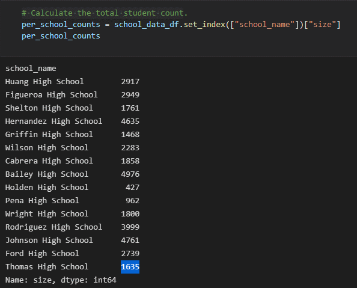
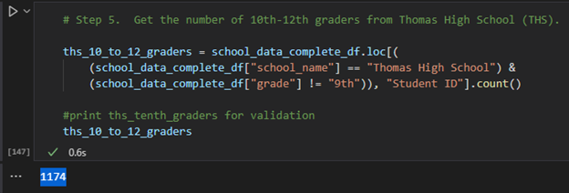
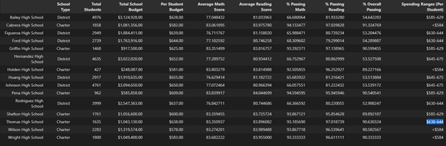
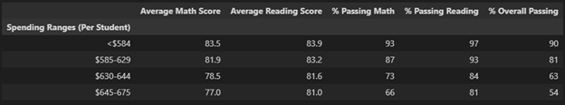
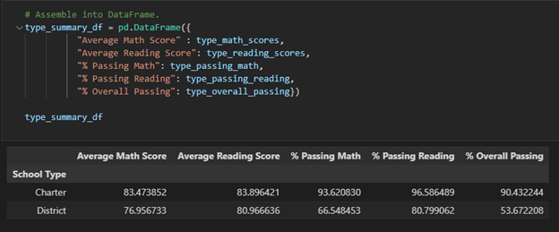
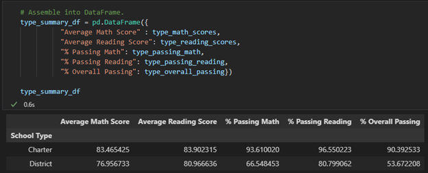

# School District Analysis

## Overview and Purpose of Analysis:
In this analyis, we worked assisted a school board by cleaning up data files and replacing grading scores for instances of plagerism in reading and math courses committed by ninth graders at Thomas High School. The school sought the assistance of a data analyst in order for them to uphold their state's testing standards. Furthermore, the school board is asking us to keep the rest of the data intact while conducting our cleaning and analysis. Lastly, we have been tasked to review our analysis we completed during the module and to compare and contrast the differences and how these changes will affect the overall data.

## Results

### How is the district summary affected?

**Before Data Clean-up**

- Average Math Score = **79.0**
- Average Reading Score = **81.9**
- % Passing Math **75**
- % Passing Reading **86** 
- % Overall Passing **65**

**Before Clean-up - PyCitySchools file**

**After Data Clean-up**

- Average Math Score = **78.9**
- Average Reading Score = **81.9**
- % Passing Math **74.8**
- % Passing Reading **85.7** 
- % Overall Passing **64.9**

**After Clean-up - PyCitySchools_Challenge file**

**Conclusion:** There was a slight change in Average Math Score, as well as % Passing district averages. The average shown between the two dataframes is the difference when the 9th grade student Math and Reading scores from Thomas High Schools were excluded from the overall summary.

### How is the school summary affected?

**Before Data Clean-up**

- Thomas High School's % Overall Passing was **90.94%**, placing second overall

**Before Clean-up - PyCitySchools file**

**AFTER DATA Clean-up**

- Thomas High School's % Overall Passing was **90.63%**, remaining in second place overall

**After Clean-up - PyCitySchools_Challenge file**

**Conclusion:** Overall rankings of schools was not changed due to Thomas High School's ninth grade student's plagerism. The data clean-up shows Thomas High School remaining in second place overall for % Overall Passing.

### How does replacing the ninth graders’ math and reading scores affect Thomas High School’s performance relative to the other schools?

**Conclusion:** By replacing the ninth graders who committed plagerism grades in Reading and Math with NaN, Thomas High School’s overall performance between the other schools did not shift. 

### How does replacing the ninth-grade scores affect the following:
- Analysis below:

    * Math and reading scores by grade
        - Math and Reading Scores from Thomas High School 9th Grade set to "NaN" are equivalent to 0.
        - Math and Reading Scores from Thomas High School 9th Grade results in the students failing recieving a 0.
        - Student count() Before THS Clean-up was: 1635
        - Student count() After THS Clean-up was: 1174

    * Scores by school spending
        - Thomas High School is in the spending bucket "$630-644"
        - Math and Reading Scores from Thomas High School 9th graders results in the students failing recieving a 0.
        - Student count() Before THS Clean-up was: 1635
        - Student count() After THS Clean-up was: 1174

    **Before Clean-up - THS count()**

    

    **After Clean-up - THS count()**

    

    * Scores by school size
        - By removing Thomas High School 9th Grade reduces the "% Passing Math", "% Passing Reading" and "% Overall Passing" scores for size bucket.
        - By removing students from Thomas High School's 9th Grade reduces the "% Passing Math", "% Passing Reading" and "% Overall Passing" scores for spending bucket to "$630-644"
        - Thomas High School's spending bin is "$630-644"

     **School Size**

    

     **THS Spending Bin "$630-644"**

    

    

     **THS Before Clean-up on Spending Rank**   

    

    * Scores by school type
        - Thomas High School is a Charter School.
        - Removing Thomas High School 9th Grade scores reduces the "% Passing Math", "% Passing Reading" and "% Overall Passing".
    
    **Before Clean-up - THS count()**

    

    **After Clean-up - THS count()**

    

## Summary

Some noteworthy observations can be made after reviewing the updated analysis. Firstly, the changes between the two datasets were not drastically different but still can affect the school system overall. The  % of Overall Passing students began at 90.94%, the second highest in overall school. When the data clean-up was conducted and grades were altered due to academic dishonesty, the % of Overall Passing students dropped to 90.63%, keeping Thomas High School in second place but affecting the school system as a whole bringing it from 65% to 64.9% for % Overall Passing by only changing the reading and math scores for one school out of fifteen. The overall math and reading scores for the school system were also dropped by a small margin, for % Passing Reading it dropped from 86% to 85.7% and for % Passing Math it dropped from 75% to 74.8%. Lastly, because Thomas High School is classified as a Charter type school, their % of passing overall and in math and reading were also impacted by the data clean-up. The gap between district and charter schools still remains favoring Charter schools but these numbers were also altered bringing the % Overall Passing from 90.4% down to 90.39%.